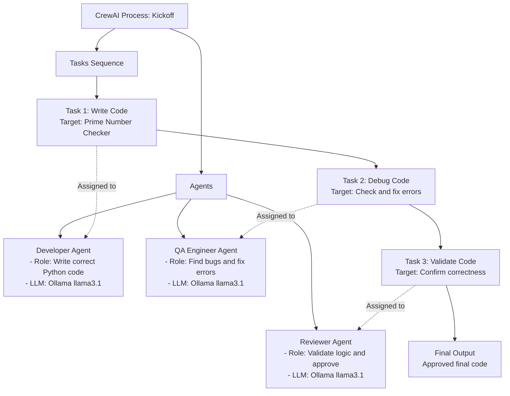

# CrewAI Workflow Diagram

Here is a visual representation of the multi-agent workflow found in your `main.py` and `python.py` files.

```mermaid
graph TD
    Crew[CrewAI Process: Kickoff]
    
    subagents[Agents]
    Crew --> subagents
    Crew --> tasks[Tasks Sequence]
    
    subagents --> Dev[Developer Agent\n- Role: Write correct Python code\n- LLM: Ollama llama3.1]
    subagents --> QA[QA Engineer Agent\n- Role: Find bugs and fix errors\n- LLM: Ollama llama3.1]
    subagents --> Rev[Reviewer Agent\n- Role: Validate logic and approve\n- LLM: Ollama llama3.1]

    tasks --> T1[Task 1: Write Code\nTarget: Prime Number Checker]
    T1 -. Assigned to .-> Dev
    
    T1 --> T2[Task 2: Debug Code\nTarget: Check and fix errors]
    T2 -. Assigned to .-> QA
    
    T2 --> T3[Task 3: Validate Code\nTarget: Confirm correctness]
    T3 -. Assigned to .-> Rev
    
    T3 --> Out[Final Output\nApproved final code]
```
